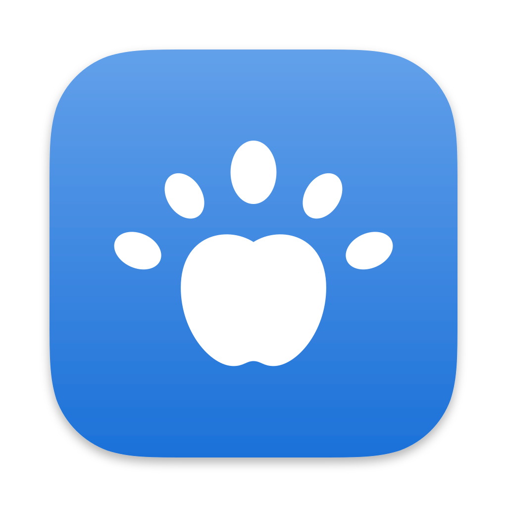

<div align="center">



# Files for MacOS

**GNOME's file manager, at home on the Mac.**

[](https://gitlab.gnome.org/GNOME/nautilus)
[](#building)
[](LICENSE)


[What's different](#changed-features) · [What's missing](#missing-features) · [Build it](#building)

</div>

---

This is a port of [Files](https://apps.gnome.org/Nautilus/), also known as Nautilus, to MacOS. It looks and works the way Files does on GNOME, and follows MacOS wherever the Mac has its own way of doing things: the Trash, apps, privacy prompts and cloud folders.

> [!NOTE]
> This is not a GNOME project. For Files itself, see the [original README](https://gitlab.gnome.org/GNOME/nautilus/-/blob/main/README.md).

## Credits

Files for MacOS uses the **[Yaru](https://github.com/ubuntu/yaru)** icon theme by the Ubuntu community. The icons are bundled with the app under CC BY-SA 4.0.

## Changed Features

Most of Files is unchanged. These are the places where it works differently than it does on GNOME.

### Appearance

Files uses the Yaru icon theme. Folders take the accent colour you chose in System Settings and change with the light and dark appearance, so the window matches the rest of your Mac.

### Sidebar

Applications, Documents, Downloads, Movies, Music and Pictures are always in the sidebar. Below them are the startup disk, your cloud folders and your other drives.

### Cloud Folders

If you use iCloud Drive, Google Drive, OneDrive or a similar service, its folder appears in the sidebar once its app is set up. Files and folders kept in the cloud carry a small cloud mark, so you can tell them apart from what is on your Mac.

### Apps

An app is shown as a single item with the icon Finder gives it, and a double-click opens it. Right-click an app to look inside it with Show Package Contents, or to remove it with Uninstall, which moves it to the Trash and can take its settings and data along.

### Search

Search finds files by name, without an index that has to be built first. Search Everywhere looks through your home folder and your apps.

### Network

Servers on your local network appear in Network by themselves, found through Bonjour. You can also connect to SFTP, WebDAV, FTP and AFP servers by address.

### Trash

The trash is the Trash of MacOS. What you delete in Files is there in Finder too, and Restore puts a file back where it came from.

### Privacy

MacOS asks before an app may open folders such as Desktop or Downloads. When Files has not been allowed into a folder, it says so and offers a button that opens the right page of System Settings. Once you allow it, the folder loads by itself.

### Other Changes

- Preferences opens with Command-comma. All other shortcuts use Control, as they do on GNOME.
- Archives are extracted by Files itself, also when you double-click one.

## Missing Features

Some of what Files does on GNOME is not available in this port.

- Searching inside the contents of files
- Windows shares (SMB)
- Phones and cameras, online accounts and NFS
- Extensions, and with them Open in Terminal
- Thumbnails. Pictures and documents show the icon of their type instead
- Saved passwords for servers
- Opening a folder as administrator

## Building

You need Homebrew with GTK 4, libadwaita and the other libraries Files uses. Homebrew's Python has to come first on `PATH`.

```bash
PATH="/opt/homebrew/bin:$PATH" meson setup build --prefix="$PWD/.deps/prefix" \
  -Dextensions=false -Dintrospection=false -Ddocs=false \
  -Dselinux=disabled -Dcloudproviders=disabled -Dtests=none
ninja -C build install
```

Installing also builds gvfs and bundles the icons.
